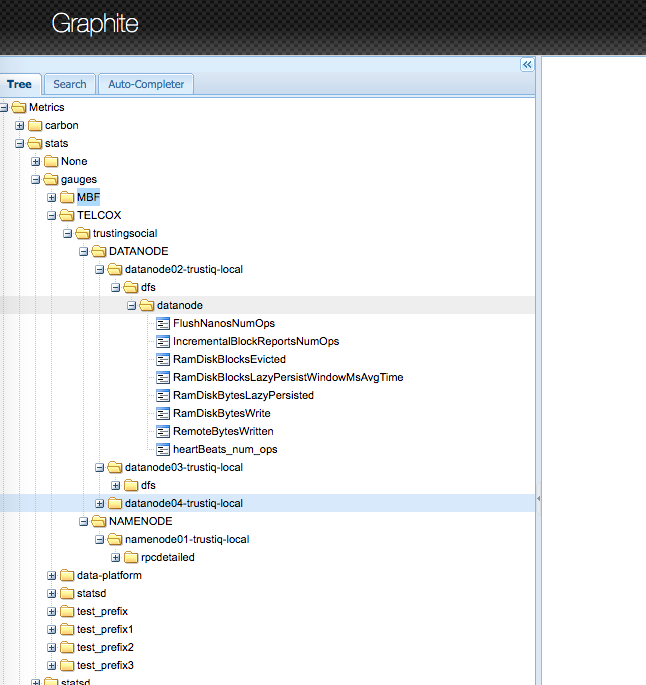

# Ambari Metrics Collector

Ambari Metrics Collector (AMCollector) is a Python collector which collects all metrics from Ambari Metrics.

AMCollector calls Ambari Metrics REST Api to get metrics and also get blacklist conf from black_list.yaml. 
From these, it create prometheus metrics.

## Usage

Start the collector by

```bash
python collector.py
```  

## Notes
- Collector support only numeric metric values, not yet supports enum types.

## Local debug
- Start the collector, it will listen on port <user-defined-port>
- Curl it

```bash
python collector.py
curl -v localhost:<user-defined-port>
``` 
## Integrate with Prometheus docker
- Pull the docker image prom/prometheus
```bash
docker run --name prom --init -p 9090:9090 -d prom/prometheus
```
- ssh into the docker container
```bash
docker ps -a
docker exec -it <container-pid> \bin\sh
```
- [Get the host ip](https://biancatamayo.me/blog/2017/11/03/docker-add-host-ip/)

For mac only using
```bash
ping docker.for.mac.localhost
```
- Change scrape_configs targets value in /etc/prometheus/prometheus.yml
- Restart the container

# USING WITH STATSD
## Install required libs
```bash
pip install -r requirement.txt
```  

## Run local
Load environment. Read `dev.env` to know about environment variables
```bash
source env/dev.env
```  

Start the collector by

```bash
python collector.py
```  

## Run local statsd
- Document: https://github.com/hopsoft/docker-graphite-statsd
- Using Graphite UI to view statsd data at [port 81](http://localhost:81)
- Grafana run at [port 80](http://localhost)
```bash
docker run -d\
 --name graphite\
 --restart=always\
 -p 80:80\
 -p 81:81\
 -p 2003-2004:2003-2004\
 -p 2023-2024:2023-2024\
 -p 8125:8125/udp\
 -p 8126:8126\
 hopsoft/graphite-statsd
 ```

## View Metrics on Graphite UI


## Run in PROD
### 1. Edit `conf/components.yaml`
Change urls to match with our system in telco.
```
namenode:
    url: http://namenode01.trustiq.local:50070/jmx
    items:
        - name: Hadoop:service=NameNode,name=FSNamesystem
          black_list:
            - '.*'
        - name: java.lang:type=Memory
          white_list:
            - HeapMemoryUsage.*
        - name: Hadoop:service=NameNode,name=FSNamesystemState
          white_list:
            - NumLiveDataNodes
            - NumDeadDataNodes
            - NumDecomLiveDataNodes
            - NumDecomDeadDataNodes
            - VolumeFailuresTotal
            - EstimatedCapacityLostTotal
            - NumDecommissioningDataNodes
            - NumStaleDataNodes
            - NumStaleStorages

resourcemanager:
    url: http://namenode01.trustiq.local:8088/ws/v1/cluster/metrics

ambari_alert:
    url: https://namenode01.trustiq.local:8080/api/v1/clusters/trustingsocial/alerts?format=summary
    white_list:
        - '.*\.count'
```

### 2. Create `prod.env`
 ```bash
cp env/sample.prod.env env/prod.env
```

### 3. Edit `prod.env`
```
export STATSD_HOST=localhost
export STATSD_PORT=8125
export STATSD_PREFIX=TELCOX
export STATSD_MAXUDPSIZE=512

export AMBARI_URI=https://localhost:8080
export AMBARI_USER=user
export AMBARI_PASS=pass

export BATCH_DELAY=60

export PYTHONWARNINGS="ignore:Unverified HTTPS request"
export CONF_FILE="conf/components.yaml"
```

### 4. Run

```bash
source env/prod.env
python collector.py
``` 


### 5. Output metrics
```
ambari_alert.CRITICAL.count => 0
ambari_alert.OK.count => 139
ambari_alert.UNKNOWN.count => 2
ambari_alert.WARNING.count => 0

namenode.BlockCapacity => 8388608
namenode.BlocksTotal => 7629432
namenode.CapacityRemaining => 85298325045432
namenode.CapacityRemainingGB => 79440.0
namenode.CapacityTotal => 225644699156480
namenode.CapacityTotalGB => 210148.0
namenode.CapacityUsed => 140034942705027
namenode.CapacityUsedGB => 130418.0
namenode.CapacityUsedNonDFS => 301386211344
namenode.CorruptBlocks => 0
namenode.EstimatedCapacityLostTotal => 0
namenode.ExcessBlocks => 0
namenode.ExpiredHeartbeats => 3
namenode.FilesTotal => 7815738
namenode.HeapMemoryUsage.committed => 4241293312
namenode.HeapMemoryUsage.init => 4294967296
namenode.HeapMemoryUsage.max => 4241293312
namenode.HeapMemoryUsage.used => 3022843880
namenode.LastCheckpointTime => 1559656132797
namenode.LastWrittenTransactionId => 388079523
namenode.LockQueueLength => 0
namenode.MillisSinceLastLoadedEdits => 0
namenode.MissingBlocks => 0
namenode.MissingReplOneBlocks => 0
namenode.NonHeapMemoryUsage.committed => 131788800
namenode.NonHeapMemoryUsage.init => 2555904
namenode.NonHeapMemoryUsage.max => -1
namenode.NonHeapMemoryUsage.used => 129440744
namenode.NumActiveClients => 20
namenode.NumDeadDataNodes => 0
namenode.NumDecomDeadDataNodes => 0
namenode.NumDecomLiveDataNodes => 0
namenode.NumDecommissioningDataNodes => 0
namenode.NumFilesUnderConstruction => 24
namenode.NumLiveDataNodes => 5
namenode.NumStaleDataNodes => 0
namenode.NumStaleStorages => 0
namenode.NumTimedOutPendingReplications => 2778
namenode.PendingDataNodeMessageCount => 0
namenode.PendingDeletionBlocks => 0
namenode.PendingReplicationBlocks => 0
namenode.PostponedMisreplicatedBlocks => 0
namenode.ScheduledReplicationBlocks => 0
namenode.Snapshots => 0
namenode.SnapshottableDirectories => 0
namenode.StaleDataNodes => 0
namenode.TotalFiles => 7815738
namenode.TotalLoad => 118
namenode.TotalSyncCount => 1
namenode.TransactionsSinceLastCheckpoint => 1288
namenode.TransactionsSinceLastLogRoll => 1
namenode.UnderReplicatedBlocks => 7
namenode.VolumeFailuresTotal => 0

resourcemanager.activeNodes => 5
resourcemanager.allocatedMB => 576512
resourcemanager.allocatedVirtualCores => 289
resourcemanager.appsCompleted => 3144
resourcemanager.appsFailed => 4
resourcemanager.appsKilled => 47
resourcemanager.appsPending => 0
resourcemanager.appsRunning => 14
resourcemanager.appsSubmitted => 3209
resourcemanager.availableMB => 652288
resourcemanager.availableVirtualCores => 431
resourcemanager.containersAllocated => 69
resourcemanager.containersPending => 0
resourcemanager.containersReserved => 0
resourcemanager.decommissionedNodes => 0
resourcemanager.lostNodes => 0
resourcemanager.rebootedNodes => 0
resourcemanager.reservedMB => 0
resourcemanager.reservedVirtualCores => 0
resourcemanager.totalMB => 1228800
resourcemanager.totalNodes => 5
resourcemanager.totalVirtualCores => 720
resourcemanager.unhealthyNodes => 0
```